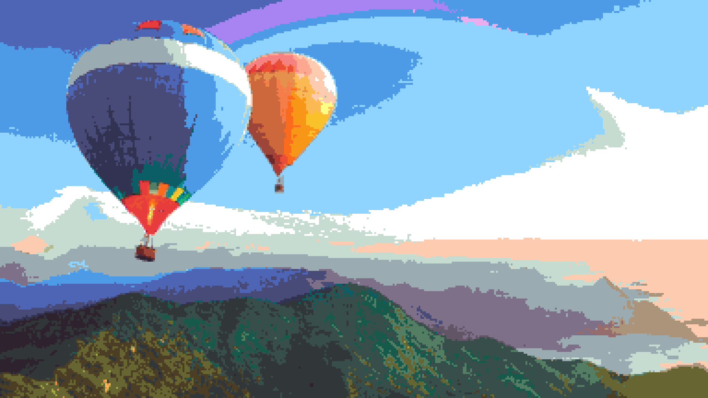
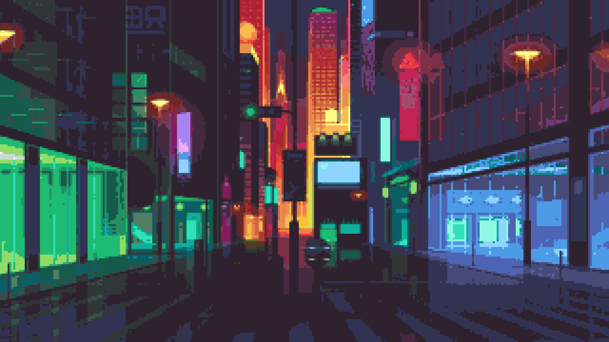

# go-pixel-art
A Go cli to convert image files into pixel art. Currently used to generate my wallpapers at startup.

## Usage

- `-i` input file path
- `-o` output file path
- `-s` pixel size in pixels
- `-c` colour palette as csv in hex format (`#7B334C,#A14D55,#C77369,#E3A084,#F2CB9B,#D37B86,#AF5D8B,#804085,#5B3374,#412051,#5C486A,#887D8D,#B8B4B2,#DCDAC9,#FFFFE0,#B6F5DB,#89D9D9,#72B6CF,#5C8BA8,#4E6679,#464969,#44355D,#3D003D,#621748,#942C4B,#C7424F,#E06B51,#F2A561,#FCEF8D,#B1D480,#80B878,#658D78`)

## Todo

- [x] add colour palette matching
- [x] `-v` verbose flag
- [x] obviously clean up the code :) "at least a little bit"
- [ ] remove the input and output defaults and cleanup the cli usage etc
- [ ] fix the odd green strip when the pixel sizes are big enough so the last one doesn't quite fit

## Examples

Here are a couple of before and after images from the wallpaper set,
shared by Distro Tube [here](https://gitlab.com/dwt1/wallpapers).

**Before**

**After**

**Before**

**After**
 
